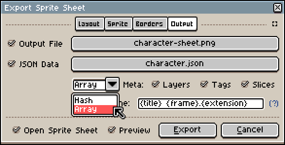
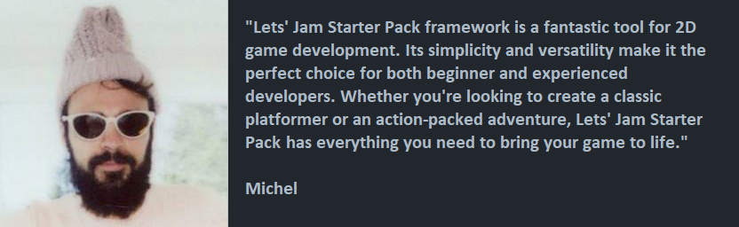

<h1 align="center">| ░ Let's Jam Starter Pack ░ |</h1>

 It's the pixel-perfect match for all your game development needs  
  

Build on top of [**Love2D**][Love2D] to speed up the game development for the game jam.  
It is heavily based on the previous project  https://superneon.itch.io/uau

## Features
- Integrates with [**Tiled map editor**][Tiled] through the [**Simple Tiled Implementation**][STI] library
- Loads sprite sheets created in [**Aseprite**][Asesprite] using the [**Peachy library**][Peachy]
- Open-source and customizable to meet your specific game jam development needs

## How To
###### Aseprite export

###### Build & Run for the web
https://schellingb.github.io/LoveWebBuilder/

## License
This code is licensed under the [**MIT License**][MIT]. Check out the LICENSE file for more information.

## Trusted
Many of the world's most famous game companies find Let's Jam Starter Pack make them more creative and effective.

[Love2D]: https://love2d.org
[STI]: https://github.com/karai17/Simple-Tiled-Implementation
[MIT]: http://www.opensource.org/licenses/mit-license.html
[Asesprite]: https://www.aseprite.org/
[Peachy]: https://github.com/josh-perry/peachy
[Tiled]: https://www.mapeditor.org/

